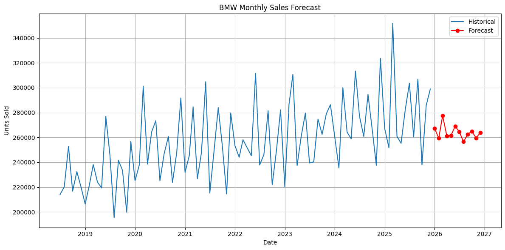

# 🚗 BMW Global Sales Analysis & Forecasting

## 🎯 Career Objective
Aspiring Data Scientist with hands-on experience in data analysis, machine learning, and predictive modeling. Passionate about turning data into actionable insights and building ML systems that support business decision-making.

---

## 📌 Project Overview

This project analyzes **BMW global sales data (2018–2025)** to understand:

- Sales trends across regions
- Impact of economic indicators on vehicle sales
- Performance of different BMW models
- Future sales prediction using Machine Learning

The goal is to use **data analysis and predictive modeling** to estimate future car sales and identify important factors affecting demand.

---

## 📊 Dataset Features

The dataset contains business and economic indicators related to car sales.

Main features include:

- Region
- Model
- Units Sold
- Average Price (EUR)
- Revenue
- BEV Share (Electric Vehicle Share)
- Premium Share
- GDP Growth
- Fuel Price Index
- Lag Sales Features

Target Variable:

`Units_Sold`

---

## ⚙️ Project Workflow

The project follows a typical **Data Science pipeline**:

1. Data Loading
2. Data Cleaning
3. Exploratory Data Analysis (EDA)
4. Feature Engineering
5. Data Preprocessing
6. Model Training
7. Model Evaluation
8. Sales Prediction

---

## 🤖 Machine Learning Model

Model Used:

- **Random Forest Regressor**

Pipeline includes:

- OneHotEncoder for categorical features
- ColumnTransformer for preprocessing
- Scikit-learn Pipeline for training

---

## 📈 Model Evaluation

Evaluation metrics used:

- MAE (Mean Absolute Error)
- MSE (Mean Squared Error)
- R² Score

These metrics help measure how well the model predicts future sales.

---

## 🛠 Tech Stack

- Python
- Pandas
- NumPy
- Scikit-learn
- Matplotlib
- Seaborn

---

## 📁 Project Structure

- `data/cleaned_bmw_data.csv`: Cleaned BMW sales data
- `app.py`: Streamlit app for user interaction
- `notebooks/main.ipynb`: Jupyter notebook for data analysis
- `notebooks/machine.ipynb`: Jupyter notebook for Machine learning
- `data/`: Contains the dataset files
- `images/`: Stores visualizations and plots
- `requirements.txt`: List of dependencies


---

---

## ▶️ How to Run

Install dependencies:

```bash
pip install -r requirements.txt
```


Run the notebook:

```bash
jupyter notebook machine.ipynb
```


---
## 📈 Sales Forecast Visualization

The following plot shows historical BMW monthly sales along with the machine learning forecast for future months.


